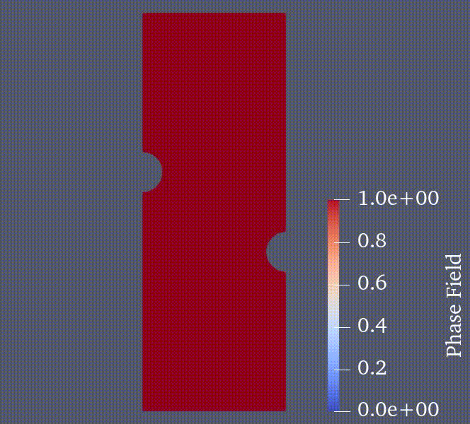

# FEM taichi 

Finite element solver for Non-linear Analysis.
<!--  -->
<!--  -->

    

## Dependencies
The following libraries are required:
| Package               | Version (>=) |
|-----------------------|--------------|
| numpy                 | 1.25.2       |
| taichi                | 1.6.0        |
| gmsh (optional)       | 4.11.1       |

## Features 
 ### Analysis types
- Elastic 
- Elastoplastic J2
- Phase field brittle fracture 
- Phase field ductile fracture 

 ### Element type
 - 2D plane strain element
 - 3D Hex element

 ### Solver type 
 - Taichi direct sparse solver 
 - Conjugate gradient solver 

## Usage
- First modify the input file `input.yaml`. The boundary conditions must be manually specified in the `FEM_utils.py` file. To run the FEM program execute `main.py`. 

