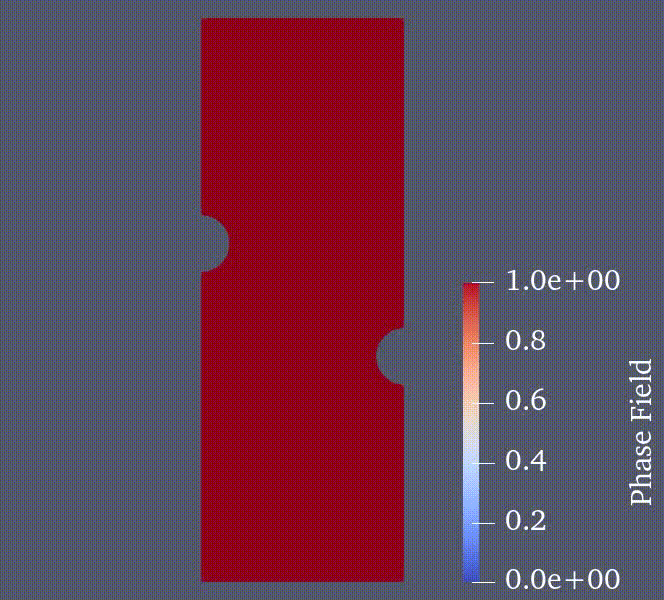

# FEM taichi 

Finite element solver for Non-linear Analysis.

## Features 
 ### Analysis type
- Elastic 
- Elastoplastic J2
- Phase field brittle fracture 
- Phase field ductile fracture 

 ### Element type
 - 2D plane strain element
 - 3D Hex element

 ### Solver type 
 - Taichi direct sparse solver 
 - Conjugate gradient solver 

## Usage
- TOdo 

